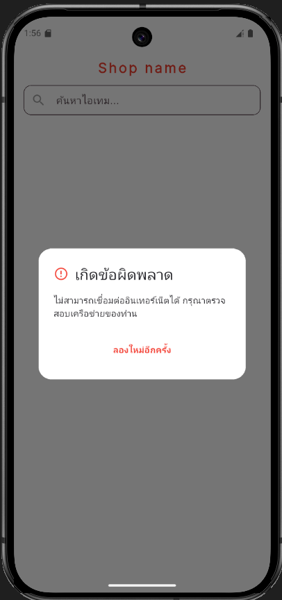

# Simple Product Lister - Flutter Assignment
## ✨ Features (คุณสมบัติเด่น)

- **Product List:** แสดงรายการสินค้าในรูปแบบ Grid 2 คอลัมน์ พร้อมระบบ Search แบบ Real-time
- **Product Detail:** หน้าแสดงรายละเอียดสินค้า พร้อม Image Swiper (PageView)
- **State Management:** ใช้ Provider ในการจัดการ Logic และสถานะของแอปทั้งหมด
- **Shimmer Loading:** แสดง Skeleton UI ขณะโหลดข้อมูลเพื่อความสวยงาม
- **Error Handling:** ระบบแจ้งเตือน Error ผ่าน Modal Popup เมื่อเกิดปัญหาทางเครือข่ายอินเทอร์เน็ตหรือเซิร์ฟเวอร์
- **Smooth Transitions:** ใช้ Hero Animation สำหรับการเปลี่ยนหน้าจาก List ไปยัง Detail

---

## 📸 Screenshots



---

## 🛠️ Tech Stack & Architecture
- **Framework:** Flutter
- **State Management:** Provider
- **Networking:** Http Package
- **UI/UX:** Slivers, Shimmer, CachedNetworkImage, Hero Animation
- **Architecture:** Feature-based Structure
  
```text
lib/
 ├── core/              # ระบบพื้นฐานและ Constants
 ├── data/              # Model และการจัดการ JSON
 ├── features/          # หน้าจอและ Logic ของแต่ละฟีเจอร์
 │    └── products/
 │         ├── providers/
 │         └── screens/
 └── main.dart          # จุดเริ่มต้นของแอป
```

---

## 🧠 State Management Explanation (คำอธิบายการจัดการสถานะ)
**อธิบายสั้นๆ เกี่ยวกับวิธีการจัดการ State (Loading, Data, Error) ในหน้า Product List:**
ผมเลือกใช้ **Provider** ร่วมกับแนวคิด **State-driven UI** โดยมีขั้นตอนการทำงานดังนี้ครับ:
1. **Loading State:** เมื่อเริ่มดึงข้อมูล แอปจะเปลี่ยนสถานะเป็น `loading` ทันที และแสดง `ProductSkeleton` (Shimmer) เพื่อให้ผู้ใช้เห็นโครงร่างของข้อมูล
2. **Data (Success) State:** เมื่อได้รับข้อมูลจาก REST API แอปจะทำการแปลง JSON ผ่าน `Product.fromJson` และเก็บไว้ในรายการสินค้า จากนั้นเรียก `notifyListeners()` เพื่อให้ UI วาดรายการสินค้า `SliverGrid`
3. **Error State:** ในกรณีที่เกิดข้อผิดพลาด เช่น `SocketException` (อินเทอร์เน็ตขัดข้อง) หรือ Server Error แอปจะเปลี่ยนสถานะเป็น `error` และแสดงผลผ่าน **Modal Alert Dialog** เพื่อแจ้งปัญหาให้ผู้ใช้ทราบอย่างชัดเจน พร้อมปุ่ม **Retry** เพื่อดึงข้อมูลใหม่โดยไม่ต้องเริ่มแอปใหม่

---

## 🤖 AI Tools Usage
ในโปรเจกต์นี้ผมได้นำ AI มาใช้ในฐานะ "Thought Partner" เพื่อเพิ่มประสิทธิภาพในการทำงานตามแนวคิดสมัยใหม่ที่เน้นความเร็ว (Speed) และความถูกต้อง (Accuracy):

- Structural Design: ผมใช้ AI ช่วยร่างโครงสร้าง Folder และ State Management เพื่อให้มั่นใจว่าเป็นไปตาม Best Practice และ Scalable ได้ในอนาคต ทำให้ประหยัดเวลาในการเตรียม Boilerplate และไปโฟกัสที่ Business Logic ได้มากขึ้น
- Widget Exploration: AI ช่วยแนะนำ Widget และ Library ที่น่าสนใจ เช่น Hero Animation (สำหรับ Smooth transition) และ Shimmer (สำหรับ Skeleton loading) ซึ่งช่วยยกระดับ UX ของแอป
- Quality Control: โค้ดที่ได้จาก AI ทั้งหมดผ่านการตรวจสอบ (Code Review) และปรับแต่งโดยผมเพื่อให้ตรงตามความต้องการของ Assignment นี้ 100%

ผมเชื่อว่าในยุคปัจจุบัน ความเร็วเป็นหัวใจหลัก การรู้จักใช้ AI อย่างมีประสิทธิภาพ (Prompt Engineering) จะช่วยให้นักพัฒนาส่งมอบงานที่มีคุณภาพสูงได้ภายในเวลาที่จำกัดครับ

---

## ⚙️ Setup & Installation
1. Clone the repository: `git clone [Your-Repo-URL]`
2. Install dependencies: `flutter pub get`
3. Run the app: `flutter run`
